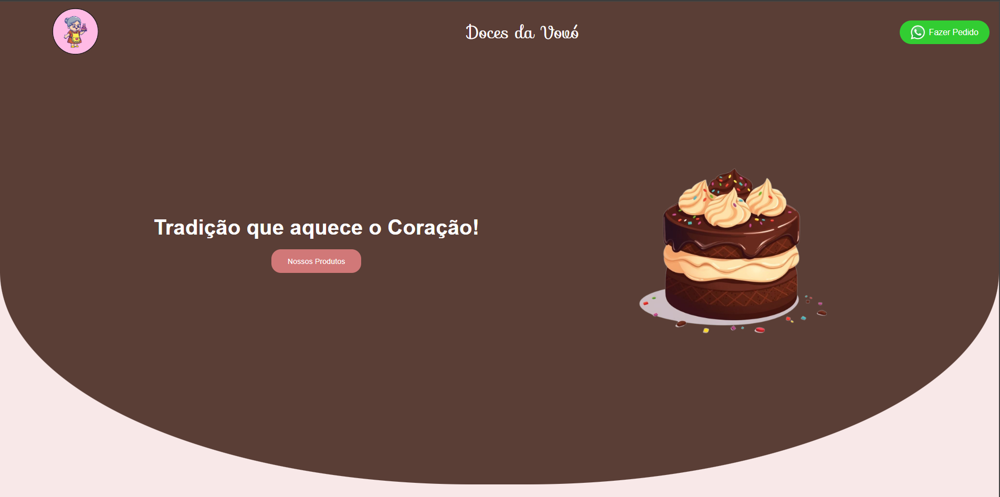

# 🍰 Doces Da Vovó

Bem-vindo ao **Doces Da Vovó**, um site para pedidos de deliciosos doces caseiros! 🧁🎂  

## 📌 Sobre o Projeto

O **Doces Da Vovó** é uma plataforma que permite aos clientes visualizar o catálogo de doces e entrar em contato diretamente pelo WhatsApp para fazer pedidos.  

## 🚀 Como Acessar

Para acesar o site **Doces Da Vovó** você deverá acessar pelo endereço de IP da máquina onde a aplicação está hospedada, exemplo: 198.162.0.10/DocesDaVovo/

## 🚀 Funcionalidades

✔ Exibição dos produtos disponíveis  
✔ Botão para contato direto via WhatsApp com mensagem pré-definida  
✔ Formulário de contato para sugestões e dúvidas  
✔ Slideshow de imagens na página principal  
✔ Animações suaves para uma melhor experiência do usuário  

## 🛠 Licença do Produto

© 2025 - Doces da Vovó - Todos os Direitos Reservados

## 🛠 Status do Projeto

Concluído

## 🛠 Tecnologias Utilizadas

O site foi desenvolvido utilizando as seguintes tecnologias:

- **HTML5** → Estrutura do site  
- **CSS3** → Estilização e animações  
- **JavaScript** → Validação de formulários, troca automática de imagens e integração com WhatsApp  
- **PHP** → Processamento do formulário de contato  

## 🎨 Imagem de Capa

## 🛠 Badges

ChatGPT;
W3Schols;
CSSButtons.

